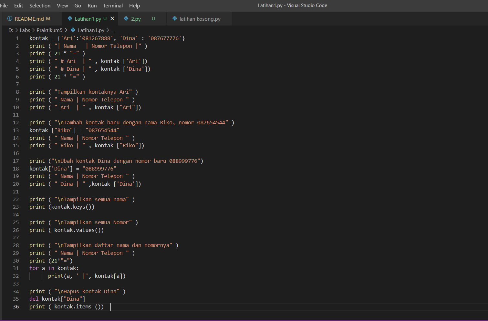
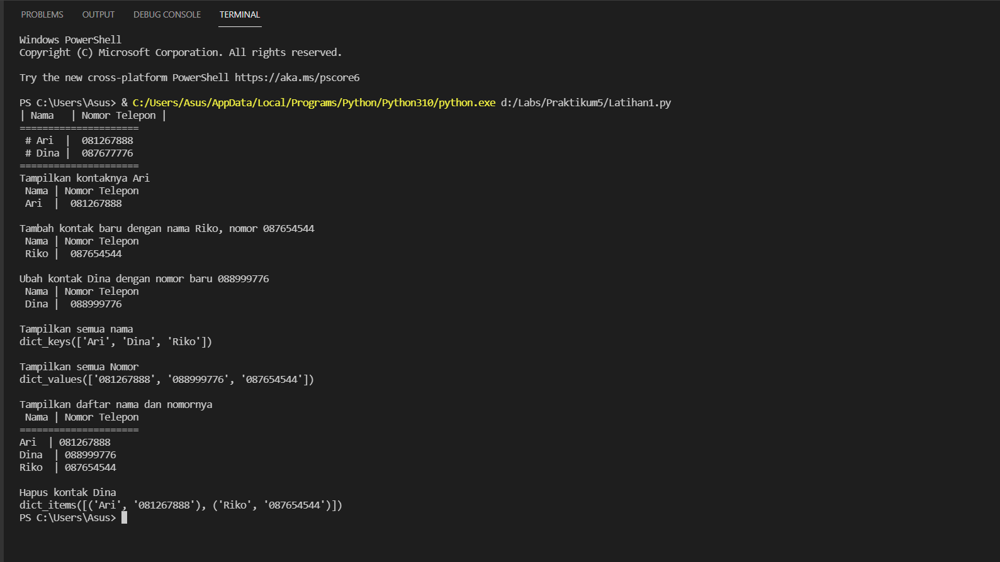
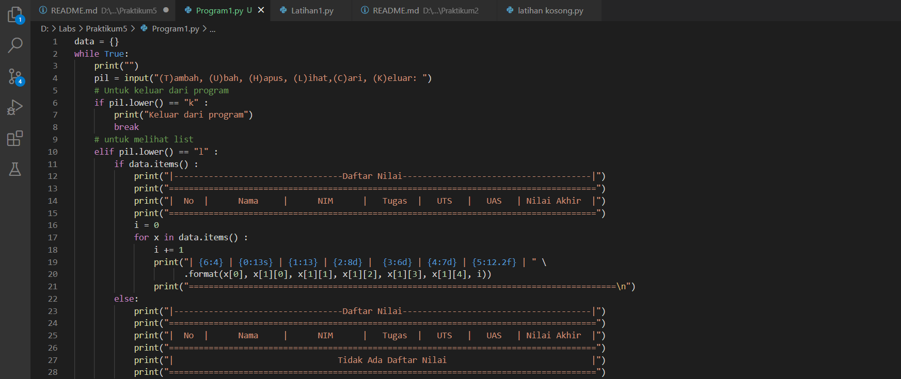
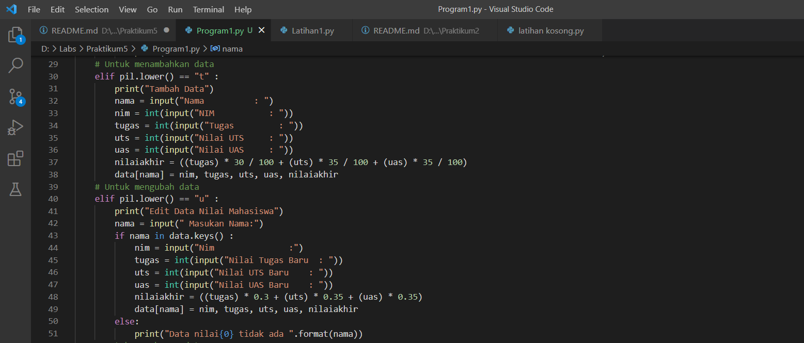
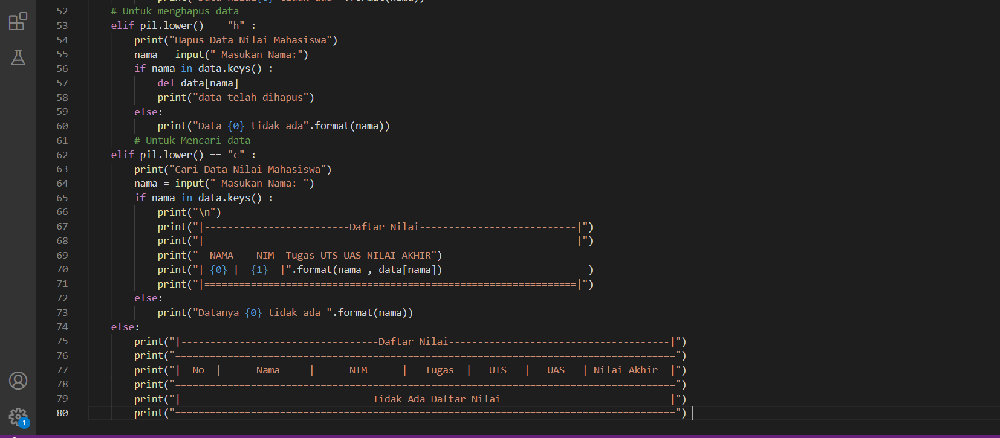
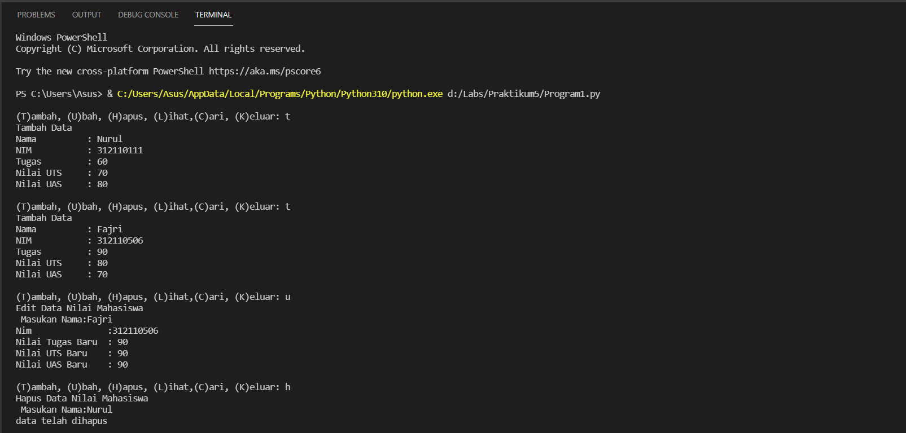
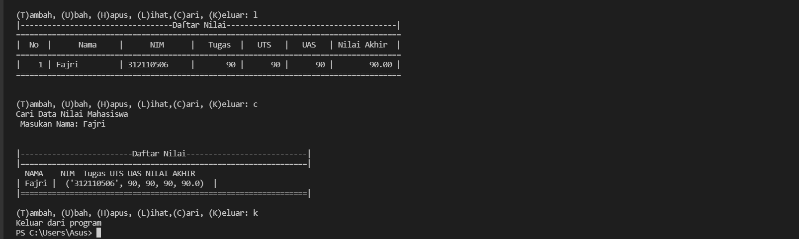

# Praktikum5
## Latihan 
Berikut adalah tugas dari latihan membuat Dictionary daftar kontak dan berikut adalah source codenya

Dan ini adalah hasil setelah di run 

## Tugas Praktikum
Buat program sederhana yang akan menampilkan daftar nilai
mahasiswa, dengan ketentuan  
• Program dibuat dengan menggunakan Dictionary  
• Tampilkan menu pilihan: (Tambah Data, Ubah Data, Hapus Data,
Tampilkan Data, Cari Data)  
• Nilai Akhir diambil dari perhitungan 3 komponen nilai (tugas: 30%,
uts: 35%, uas: 35%)  
Berikut adalah source codenya

Dan ini adalah hasil setelah di run

Dan beikut adalah flowchart nya 
